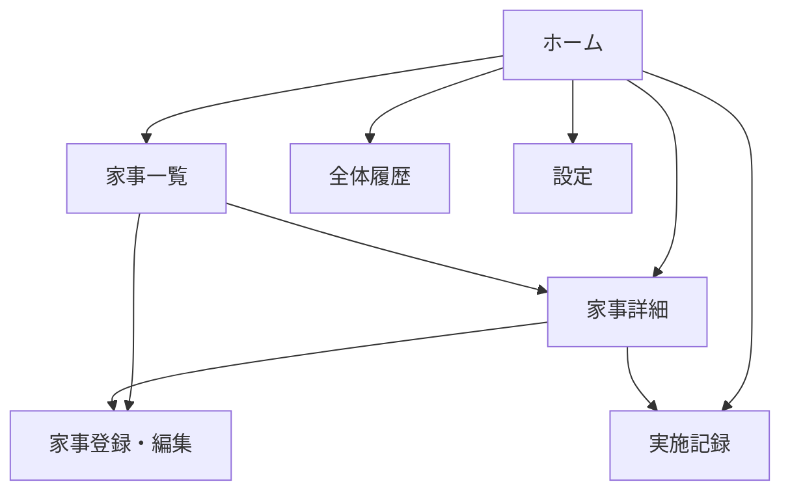
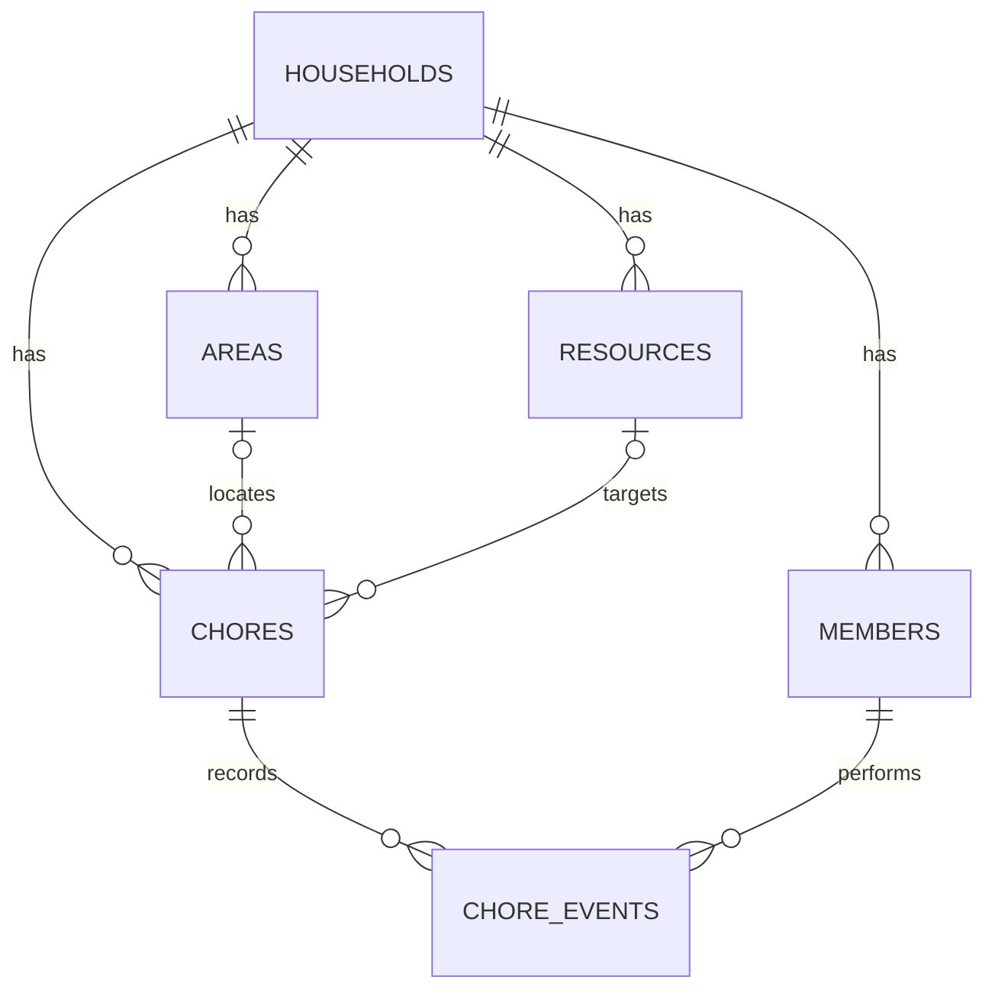

# 家事管理アプリ 設計書

**文書バージョン:** 1.0  
**作成日:** 2026-09-16  
**対象:** MVP実装、および将来の「家庭OS」連携  
**想定読者:** Claude / Codexなどの実装エージェント、開発者

---

## 1. 概要

### 1.1 目的

家庭内の家事を、単発のToDoではなく「定期的にメンテナンスする対象」として管理する。

各家事について、前回の実施日時と推奨実施間隔を記録し、次の状態を自動判定する。

- まだやらなくてよい
- そろそろ
- 今日やった方がよい
- 優先してやるべき

これにより、利用者が家事の全量や実施時期を頭の中だけで管理する負担を減らす。

### 1.2 コンセプト

本アプリは「家事版ToDoリスト」ではなく、店舗運営ゲームの設備管理に近い。

- 家事には完了後も次回がある
- 家事の状態は、時間経過と実施によって変わる
- 利用者は家全体を見渡し、今日手を入れる場所を判断する
- 実行結果は履歴として蓄積される

将来的には、レシピ管理、冷蔵庫在庫管理、家庭イベント管理などと統合し、「家庭OS」の家事・保守運用モジュールとする。

### 1.3 解決したい課題

- 家事の種類が多く、何を管理対象にすべきか分かりにくい
- 最後にいつ実施したか思い出せない
- 頻繁に実施しすぎる家事と、長期間放置する家事が生じる
- 赤ちゃん・犬関連を含め、通常家事以外の管理対象も増えている
- 「今すぐ必要な家事」と「まだ放置してよい家事」の区別に認知負荷がかかる
- 実際の家事量や分担を、記憶ではなく履歴で把握したい

---

## 2. 設計原則

1. **締切より状態を重視する**  
   曜日固定や厳密な期限ではなく、前回実施からの経過時間で優先度を判断する。

2. **完了操作を最短にする**  
   日常的に使うため、「やった」操作は原則1タップで完了できるようにする。

3. **履歴を上書きしない**  
   最終実施日時だけを書き換えず、すべての実施をイベントとして追加保存する。

4. **できなかったことを責めない**  
   連続記録や失敗演出は設けず、現状と次の行動を淡々と表示する。

5. **家庭OSとの疎結合を保つ**  
   家事アプリは単体で動作させ、場所・対象リソース・イベントなどの共通概念だけを連携可能にする。

6. **計算可能な値を重複保存しない**  
   最終実施日時・経過日数・状態は履歴から導出する。高速化が必要な場合のみキャッシュする。

---

## 3. 用語定義

| 用語 | 定義 |
|---|---|
| 家事項目 | 「風呂の排水溝掃除」など、繰り返し実施する作業の定義 |
| 実施履歴 | 家事を実施した事実を表す不変のイベント |
| 場所 | キッチン、浴室、リビングなど、家事を行うエリア |
| 対象リソース | 冷蔵庫、浴槽、哺乳瓶、犬用品など、家事の対象物 |
| 推奨間隔 | 前回実施から次の実施を推奨するまでの標準日数 |
| 予告日数 | 推奨間隔の何日前から「そろそろ」と表示するか |
| 猶予日数 | 推奨間隔を過ぎてから「優先」に変わるまでの日数 |
| 初回未実施 | 家事項目は登録済みだが、実施履歴が一度もない状態 |

---

## 4. MVPの対象範囲

### 4.1 MVPに含める機能

1. 家事項目の登録・編集・無効化
2. 場所・カテゴリ・対象リソースの設定
3. 推奨間隔、予告日数、猶予日数の設定
4. 前回実施からの経過日数と状態の自動判定
5. 「やった」ボタンによる実施記録
6. 任意日時での実施記録
7. 誤登録した履歴の取消
8. 今日の家事候補一覧
9. 全家事項目一覧
10. 家事項目ごとの実施履歴表示
11. 全体の実施履歴表示
12. 朝1回のまとめ通知
13. スマートフォンで使いやすいレスポンシブUI
14. 家庭単位・利用者単位を持つデータ構造

### 4.2 MVPに含めない機能

- 実績から推奨間隔を自動変更する機能
- ゲーム的な得点、連続記録、ランキング
- 家全体や部屋ごとの清潔度スコア
- 所要時間を考慮した自動スケジューリング
- 曜日固定・特定日固定・季節限定の繰り返し
- 条件発火型家事（在庫がゼロになったら補充など）
- 家族への割当、承認、催促
- 写真添付
- コメント・チャット
- レシピ・在庫管理との実データ連携
- 外部カレンダー連携
- AIによる家事提案
- オフライン同期

上記はデータ構造上の拡張余地を残すが、MVP画面やロジックには持ち込まない。

---

## 5. 想定利用者と権限

### 5.1 MVPの利用者

- 1つの家庭に所属する本人と配偶者
- 初期実装では本人のみの利用でも成立する

### 5.2 権限

MVPでは家庭内メンバー全員を同一権限とする。

- 家事項目の閲覧・登録・編集・無効化
- 実施記録の登録・取消
- 家庭内履歴の閲覧

将来的に閲覧者・編集者などを設けられるよう、各データには `household_id` を持たせる。

---

## 6. 主要ユースケース

### UC-01 今日やる家事を確認する

1. 利用者がホーム画面を開く
2. システムが各家事項目の状態を算出する
3. 「優先」「今日やった方がよい」「そろそろ」の順に表示する
4. 利用者は、今日行う家事を選ぶ

### UC-02 家事を実施済みにする

1. 利用者が家事項目の「やった」を押す
2. システムが現在日時・実施者を初期値として確認UIを表示する
3. 利用者が確定する
4. 実施イベントが追加される
5. 対象家事の状態が「まだ不要」に更新される

通常操作では、設定により確認UIを省略し、1タップ登録としてもよい。

### UC-03 過去に行った家事を記録する

1. 利用者が家事項目から「日時を指定して記録」を選ぶ
2. 実施日時を入力する
3. 必要に応じて実施者・メモを入力する
4. 実施イベントを追加する
5. 最新の有効な実施日時を基準に状態を再計算する

### UC-04 誤って記録した履歴を取り消す

1. 利用者が履歴詳細を開く
2. 「この記録を取り消す」を選ぶ
3. 確認後、履歴に取消日時と取消者を記録する
4. レコード自体は削除せず、状態計算の対象外とする

### UC-05 家事項目を追加する

1. 名称、場所、推奨間隔を入力する
2. 予告日数、猶予日数には推奨初期値を入れる
3. 必要に応じてカテゴリ、対象リソース、メモ、最終実施日時を入力する
4. 保存後、今日の家事一覧へ反映する

### UC-06 朝のまとめ通知から今日の家事を確認する

1. 指定時刻に、その家庭のタイムゾーンで状態を算出する
2. 「今日やった方がよい」「優先」の件数と上位項目を1通知にまとめる
3. 通知をタップするとホーム画面を開く

---

## 7. 家事の状態判定

### 7.1 状態一覧

| 内部値 | 表示名 | 意味 | 表示色の目安 |
|---|---|---|---|
| `not_due` | まだ不要 | 現時点では実施不要 | 緑またはグレー |
| `upcoming` | そろそろ | 近いうちに実施時期になる | 黄 |
| `recommended` | 今日やった方がよい | 推奨間隔を超えた | オレンジ |
| `overdue` | 優先 | 猶予期間も超えた | 赤 |
| `never_done` | 初回未実施 | 実施履歴がない | 青または紫 |
| `inactive` | 無効 | 一覧・通知の通常対象外 | グレー |

### 7.2 判定入力値

- `last_completed_at`: 最新の有効な実施日時
- `interval_days`: 推奨間隔
- `warning_days`: 予告日数
- `grace_days`: 猶予日数
- `now`: 現在日時
- `timezone`: 家庭のタイムゾーン。初期値は `Asia/Tokyo`

### 7.3 経過日数

日常の感覚に合わせ、経過日数は家庭のタイムゾーンにおける暦日差で計算する。

```text
elapsed_days = date(now, timezone) - date(last_completed_at, timezone)
```

同じ日の再実施は `elapsed_days = 0` とする。

### 7.4 判定式

```text
if inactive:
    inactive
else if 有効な実施履歴がない:
    never_done
else if elapsed_days < interval_days - warning_days:
    not_due
else if elapsed_days <= interval_days:
    upcoming
else if elapsed_days <= interval_days + grace_days:
    recommended
else:
    overdue
```

入力値には次の制約を設ける。

```text
interval_days >= 1
0 <= warning_days < interval_days
grace_days >= 0
```

### 7.5 判定例

推奨間隔7日、予告日数2日、猶予日数3日の場合:

| 経過日数 | 状態 |
|---:|---|
| 0〜4日 | まだ不要 |
| 5〜7日 | そろそろ |
| 8〜10日 | 今日やった方がよい |
| 11日以上 | 優先 |

### 7.6 推奨初期値

新規登録時は次を初期値とする。

```text
warning_days = max(1, round(interval_days * 0.25))
grace_days   = max(1, round(interval_days * 0.25))
```

ただし、`warning_days` は必ず `interval_days - 1` 以下へ補正する。

### 7.7 初回未実施の扱い

登録時に最終実施日時を入力しなかった場合は `never_done` とする。

- ホーム画面では「初回未実施」セクションに表示する
- `overdue` と同じ赤色にはしない
- 通知には原則含めない
- 登録から7日経過後も未実施の場合のみ、まとめ通知の末尾に「初回記録待ち」として件数表示する

---

## 8. 画面設計

### 8.1 画面一覧

| ID | 画面 | 主な目的 |
|---|---|---|
| S-01 | ホーム／今日の家事 | 今日検討すべき家事を確認・実施する |
| S-02 | 家事一覧 | 全家事項目を検索・絞り込みする |
| S-03 | 家事詳細 | 状態、設定、履歴を確認する |
| S-04 | 家事登録・編集 | 家事項目を登録・変更する |
| S-05 | 実施記録 | 実施日時、実施者、メモを登録する |
| S-06 | 全体履歴 | 家庭内で行われた家事を時系列に見る |
| S-07 | 設定 | 通知時刻、タイムゾーン等を変更する |

### 8.2 S-01 ホーム／今日の家事

#### 表示順

1. 優先
2. 今日やった方がよい
3. そろそろ
4. 初回未実施
5. 本日実施済み

`not_due` の全項目はホームに並べず、「まだ不要 ○件」と折りたたみ表示する。

#### 家事カードの表示項目

- 家事名
- 場所
- 状態
- 前回実施日
- 経過日数
- 推奨間隔
- 「やった」ボタン
- 詳細ボタン

#### 空状態

対象家事がない場合:

> 今日、急いでやる家事はありません。

「全部完璧」など過剰な評価表現は避ける。

### 8.3 S-02 家事一覧

#### 機能

- 名称検索
- 状態による絞り込み
- 場所による絞り込み
- カテゴリによる絞り込み
- 有効／無効の切替表示
- 状態順、経過日数順、名称順の並び替え
- 新規登録

### 8.4 S-03 家事詳細

#### 表示項目

- 名称
- 現在状態
- 前回実施日時
- 次の状態変化予定日
- 推奨間隔、予告日数、猶予日数
- 場所、カテゴリ、対象リソース
- 説明・メモ
- 最近の実施履歴
- 平均実施間隔（履歴が2件以上ある場合。参考表示のみ）
- 編集、無効化、実施記録

### 8.5 S-04 家事登録・編集

#### 必須項目

- 家事名
- 推奨間隔

#### 任意項目

- カテゴリ
- 場所
- 対象リソース
- 予告日数
- 猶予日数
- 初回登録時の最終実施日時
- 説明・メモ

編集は今後の判定に即時反映する。過去の実施履歴は変更しない。

### 8.6 S-05 実施記録

- 実施日時: 現在日時を初期値とする
- 実施者: ログイン中の利用者を初期値とする
- メモ: 任意
- 保存

未来日時は登録不可とする。最新履歴より古い日時の登録は許可する。

### 8.7 S-06 全体履歴

- 新しい順で表示
- 日付、家事名、場所、実施者、メモを表示
- 家事、場所、実施者、期間で絞り込み
- 取り消された履歴は通常非表示とし、切替で表示可能

### 8.8 S-07 設定

- 通知ON/OFF
- 朝のまとめ通知時刻。初期値 `08:00`
- 通知へ「そろそろ」を含めるか。初期値OFF
- タイムゾーン。初期値 `Asia/Tokyo`
- 1タップで即記録するか。初期値ON

---

## 9. 画面遷移



モバイルの主要ナビゲーションは「今日」「家事」「履歴」「設定」の4項目とする。

---

## 10. データモデル

IDはUUIDを推奨する。日時はDB上ではUTCで保存し、表示・暦日計算時に家庭のタイムゾーンへ変換する。

### 10.1 `households`

| カラム | 型 | 必須 | 説明 |
|---|---|---:|---|
| `id` | UUID | ○ | 家庭ID |
| `name` | string | ○ | 家庭名 |
| `timezone` | string | ○ | IANAタイムゾーン |
| `created_at` | datetime | ○ | 作成日時 |
| `updated_at` | datetime | ○ | 更新日時 |

### 10.2 `members`

| カラム | 型 | 必須 | 説明 |
|---|---|---:|---|
| `id` | UUID | ○ | メンバーID |
| `household_id` | UUID | ○ | 家庭ID |
| `display_name` | string | ○ | 表示名 |
| `user_id` | string | - | 認証基盤の利用者ID |
| `is_active` | boolean | ○ | 有効状態 |
| `created_at` | datetime | ○ | 作成日時 |
| `updated_at` | datetime | ○ | 更新日時 |

### 10.3 `areas`

| カラム | 型 | 必須 | 説明 |
|---|---|---:|---|
| `id` | UUID | ○ | 場所ID |
| `household_id` | UUID | ○ | 家庭ID |
| `name` | string | ○ | 例: 浴室、キッチン |
| `sort_order` | integer | ○ | 表示順 |
| `is_active` | boolean | ○ | 有効状態 |
| `created_at` | datetime | ○ | 作成日時 |
| `updated_at` | datetime | ○ | 更新日時 |

### 10.4 `resources`

家庭OSで他モジュールと共有可能な対象物を表す。

| カラム | 型 | 必須 | 説明 |
|---|---|---:|---|
| `id` | UUID | ○ | リソースID |
| `household_id` | UUID | ○ | 家庭ID |
| `area_id` | UUID | - | 主な設置場所 |
| `resource_type` | string | ○ | `appliance`, `fixture`, `baby_item`, `pet_item`, `storage`, `other` |
| `name` | string | ○ | 例: 冷蔵庫、浴槽 |
| `external_ref` | string | - | 他モジュール上のID |
| `is_active` | boolean | ○ | 有効状態 |
| `created_at` | datetime | ○ | 作成日時 |
| `updated_at` | datetime | ○ | 更新日時 |

### 10.5 `chore_categories`

| カラム | 型 | 必須 | 説明 |
|---|---|---:|---|
| `id` | UUID | ○ | カテゴリID |
| `household_id` | UUID | ○ | 家庭ID |
| `name` | string | ○ | 掃除、洗濯、補充、犬、赤ちゃん用品など |
| `sort_order` | integer | ○ | 表示順 |
| `is_active` | boolean | ○ | 有効状態 |

### 10.6 `chores`

| カラム | 型 | 必須 | 説明 |
|---|---|---:|---|
| `id` | UUID | ○ | 家事項目ID |
| `household_id` | UUID | ○ | 家庭ID |
| `name` | string | ○ | 家事名 |
| `description` | text | - | 説明・メモ |
| `category_id` | UUID | - | カテゴリID |
| `area_id` | UUID | - | 場所ID |
| `resource_id` | UUID | - | 対象リソースID |
| `schedule_type` | enum | ○ | MVPでは `interval` 固定 |
| `interval_days` | integer | ○ | 推奨間隔 |
| `warning_days` | integer | ○ | 予告日数 |
| `grace_days` | integer | ○ | 猶予日数 |
| `is_active` | boolean | ○ | 有効状態 |
| `created_by` | UUID | ○ | 登録者 |
| `created_at` | datetime | ○ | 作成日時 |
| `updated_at` | datetime | ○ | 更新日時 |

制約:

- 同一家庭で同名家事を許容するが、同名登録時に警告する
- 別家庭のカテゴリ・場所・リソースを参照できない
- 物理削除は行わず無効化する

### 10.7 `chore_events`

| カラム | 型 | 必須 | 説明 |
|---|---|---:|---|
| `id` | UUID | ○ | イベントID |
| `household_id` | UUID | ○ | 家庭ID |
| `chore_id` | UUID | ○ | 家事項目ID |
| `event_type` | enum | ○ | MVPでは `completed` |
| `occurred_at` | datetime | ○ | 実際に行った日時 |
| `actor_member_id` | UUID | ○ | 実施者 |
| `recorded_by_member_id` | UUID | ○ | 記録者 |
| `note` | text | - | メモ |
| `voided_at` | datetime | - | 取消日時 |
| `voided_by_member_id` | UUID | - | 取消者 |
| `void_reason` | text | - | 取消理由 |
| `created_at` | datetime | ○ | 登録日時 |

最新実施日時は、`voided_at IS NULL` かつ `event_type = completed` の `MAX(occurred_at)` で求める。

### 10.8 `notification_settings`

| カラム | 型 | 必須 | 説明 |
|---|---|---:|---|
| `id` | UUID | ○ | 設定ID |
| `member_id` | UUID | ○ | 対象メンバー |
| `daily_summary_enabled` | boolean | ○ | 通知ON/OFF |
| `daily_summary_time` | time | ○ | 通知時刻 |
| `include_upcoming` | boolean | ○ | 「そろそろ」を含めるか |
| `one_tap_complete` | boolean | ○ | 即時記録するか |
| `updated_at` | datetime | ○ | 更新日時 |

### 10.9 ER図



---

## 11. API設計

REST APIを例示する。フレームワークに応じてServer ActionsやRPCへ置換してよいが、責務は維持する。

### 11.1 家事

| Method | Path | 用途 |
|---|---|---|
| `GET` | `/api/chores` | 一覧取得。状態、場所、カテゴリで絞り込み |
| `POST` | `/api/chores` | 家事項目登録 |
| `GET` | `/api/chores/{id}` | 詳細取得 |
| `PATCH` | `/api/chores/{id}` | 家事項目編集・無効化 |
| `GET` | `/api/chores/today` | 今日の家事候補取得 |

### 11.2 実施履歴

| Method | Path | 用途 |
|---|---|---|
| `POST` | `/api/chores/{id}/events` | 実施記録追加 |
| `GET` | `/api/chores/{id}/events` | 家事別履歴取得 |
| `GET` | `/api/chore-events` | 全体履歴取得 |
| `POST` | `/api/chore-events/{id}/void` | 履歴取消 |

### 11.3 マスタ・設定

| Method | Path | 用途 |
|---|---|---|
| `GET/POST/PATCH` | `/api/areas` | 場所管理 |
| `GET/POST/PATCH` | `/api/resources` | 対象リソース管理 |
| `GET/POST/PATCH` | `/api/chore-categories` | カテゴリ管理 |
| `GET/PATCH` | `/api/settings/notifications` | 通知設定 |

### 11.4 API共通要件

- すべての読み書きで、認証利用者が対象 `household_id` に所属することを検証する
- クライアントから任意の `household_id` を信用しない
- 日時はISO 8601で受け渡す
- 一覧APIはページネーションを備える
- 状態値はサーバー側で算出し、クライアントと判定式を重複させない
- 「やった」の二重タップ対策として、短時間の再送を検出するか冪等性キーを受け付ける

---

## 12. 通知仕様

### 12.1 基本仕様

- 1日1回、利用者ごとの指定時刻にまとめて通知する
- 初期時刻は家庭のタイムゾーンで08:00
- 対象は `overdue` と `recommended`
- `upcoming` は設定で追加可能
- 対象が0件の場合は通知しない
- 無効な家事、取り消された履歴は対象外

### 12.2 通知文例

```text
今日の家事: 優先1件、やった方がよい2件
シーツ交換、風呂の排水溝、冷蔵庫整理
```

表示件数が多い場合は上位3件まで名称を表示し、残りは件数で示す。

### 12.3 優先順位

通知内の並び順:

1. 状態: `overdue` → `recommended` → `upcoming`
2. 超過日数の降順
3. 家事名の昇順

### 12.4 Webアプリ上の注意

ブラウザやPWAのPush通知は、OS・ブラウザ・HTTPS・権限許可に依存する。MVPの実装環境で安定したPush通知が難しい場合は、次の順で段階導入する。

1. アプリ内の「今日の家事」表示
2. PWA Push通知
3. メールや外部通知先

通知基盤が未完成でも、家事管理の中核機能はリリース可能とする。

---

## 13. 家庭OS連携方針

### 13.1 基本方針

各アプリを最初から一枚岩にせず、独立したモジュールとして実装する。次の概念のみ共通化する。

- `household_id`: 家庭
- `member_id`: 家族
- `area_id`: 場所
- `resource_id`: 家電・設備・収納・育児用品・犬用品など
- イベント発生日時・記録者

### 13.2 公開イベント

家事実施時に、将来は共通イベントバスへ次のイベントを公開できる構造とする。

```json
{
  "event_type": "chore.completed",
  "event_id": "uuid",
  "household_id": "uuid",
  "occurred_at": "2026-09-16T08:30:00+09:00",
  "actor_member_id": "uuid",
  "payload": {
    "chore_id": "uuid",
    "area_id": "uuid",
    "resource_id": "uuid"
  }
}
```

MVPではイベントバスを実装せず、`chore_events` を正本とする。

### 13.3 将来の連携例

| 起点 | 連携先 | 将来の動作例 |
|---|---|---|
| 冷蔵庫整理を実施 | 在庫管理 | 棚卸し画面を開き、廃棄・補正を記録 |
| 食材を廃棄 | 家事管理 | 冷蔵庫整理の実施候補を提示 |
| シーツ交換を実施 | 家事管理 | 洗濯タスクを条件発火 |
| 哺乳瓶用品を洗浄 | 育児用品 | 清潔状態や使用可能数を更新 |
| 犬用品を洗浄 | ペット管理 | 犬用品の保守履歴として表示 |
| レシピを調理 | 在庫管理 | 使用食材を差分イベントで減算 |

### 13.4 イベント管理思想の統一

- 在庫: 入庫、消費、廃棄、補正の差分イベント
- 家事: 実施、取消のイベント
- レシピ: 調理実績イベント

各モジュールの現在状態は、イベントを基に算出する。必要になった場合のみ読み取り用スナップショットを導入する。

---

## 14. 非機能要件

### 14.1 UX

- スマートフォン幅を最優先する
- ホーム表示から「やった」まで1〜2タップ以内
- 主要なタップ領域は44px以上
- 色だけで状態を区別せず、ラベル・アイコンを併用する
- 長い一覧はスケルトンまたは段階表示を用いる
- 取消可能な操作には完了後のトーストとUndo導線を設ける

### 14.2 性能

- ホーム画面は通常環境で2秒以内を目標とする
- 家事項目1,000件、履歴100,000件程度まで破綻しない設計とする
- `chore_events(chore_id, occurred_at, voided_at)` に適切なインデックスを設ける

### 14.3 セキュリティ・プライバシー

- すべてのデータを家庭単位で分離する
- APIごとに家庭所属を検証する
- 実施履歴には生活パターンが含まれるため、公開URLでアクセスさせない
- ログへメモ本文や個人情報を不用意に出力しない
- CSRF、XSS、SQLインジェクションへの標準対策を行う

### 14.4 保守性

- 状態判定関数を純粋関数として独立させ、単体テストを用意する
- 通知対象の抽出と表示用並び替えを共通サービスに集約する
- 状態名・色・文言を1箇所で定義する
- DBマイグレーションを使用する

### 14.5 アクセシビリティ

- WCAG 2.1 AA相当のコントラストを目標にする
- キーボード操作とスクリーンリーダー用ラベルを用意する
- 状態色に依存せず、必ず文字で状態を表示する

---

## 15. エラー・境界条件

| 条件 | 期待動作 |
|---|---|
| 初回履歴がない | `never_done` として表示 |
| 同日に複数回実施 | すべて履歴保存。最新時刻を採用 |
| 古い実施日時を後から登録 | 最新実施日時が変わる場合のみ状態へ反映 |
| 最新履歴を取り消す | 次に新しい有効履歴を基準に再計算 |
| 家事項目を無効化 | 通常一覧・通知から除外。履歴は保持 |
| 推奨間隔を変更 | 過去履歴は保持し、現在状態を即時再計算 |
| タイムゾーンを変更 | 新タイムゾーンの暦日で状態を再計算 |
| 家族が同時に「やった」を押す | 両方を履歴に残し、重複の可能性を警告 |
| 未来日時を入力 | 保存不可。入力エラーを表示 |
| 通知権限がない | 設定画面で状態と許可方法を表示 |

重複記録は自動削除しない。実際に2回行った可能性があるため、利用者が取消できるようにする。

---

## 16. テスト要件

### 16.1 状態判定の単体テスト

推奨間隔7日、予告2日、猶予3日の例:

| 経過日数 | 期待状態 |
|---:|---|
| 0 | `not_due` |
| 4 | `not_due` |
| 5 | `upcoming` |
| 7 | `upcoming` |
| 8 | `recommended` |
| 10 | `recommended` |
| 11 | `overdue` |

追加ケース:

- 履歴なし → `never_done`
- 無効化済み → `inactive`
- 猶予0日で推奨間隔を超過 → `overdue`
- 日付変更直前・直後
- UTCとAsia/Tokyoで日付が異なる時刻
- うるう年、月末、年末年始

### 16.2 結合テスト

- 家事登録後、ホームへ正しい状態で表示される
- 実施記録後、状態が `not_due` へ戻る
- 過去記録追加時に最新日時が正しく選ばれる
- 最新履歴取消時に1つ前の履歴が採用される
- 無効家事が通知対象にならない
- 他家庭の家事・履歴へアクセスできない
- 同一APIの再送で意図しない重複が発生しない

### 16.3 E2Eテスト

1. ログイン
2. 家事項目登録
3. ホームで状態確認
4. 「やった」を実行
5. 履歴で記録確認
6. 記録取消
7. 状態が元に戻ることを確認

---

## 17. 受入条件

MVP完成とみなす条件:

- 家事を登録・編集・無効化できる
- 前回実施日と設定値から状態が仕様どおり算出される
- ホームで優先度順に今日の候補を確認できる
- 家事を1タップまたは2タップで記録できる
- 履歴が上書きされず、時系列で確認できる
- 誤登録を取り消せる
- 場所・カテゴリで絞り込める
- 通知が有効な環境では、朝1回のまとめ通知を受け取れる
- スマートフォンで主要操作を支障なく行える
- 家庭をまたいだデータ参照・更新ができない
- 状態判定、履歴追加、取消について自動テストがある

---

## 18. 推奨初期データ

実際の頻度は家庭に合わせて変更する。以下は登録を始めやすくするための例であり、医学的・衛生的基準ではない。

### 場所

- キッチン
- 浴室
- 洗面所
- トイレ
- リビング
- 寝室
- 玄関
- 物干部屋
- 犬用品
- 赤ちゃん用品

### カテゴリ

- 掃除
- 洗濯
- 交換
- 補充
- 整理
- 犬
- 赤ちゃん用品
- その他

### 家事項目例

| 家事項目 | 場所 | 推奨間隔の例 |
|---|---|---:|
| 掃除機をかける | リビング | 3日 |
| 風呂の排水溝を掃除する | 浴室 | 7日 |
| シーツを交換する | 寝室 | 14日 |
| 冷蔵庫を整理する | キッチン | 30日 |
| 換気扇を掃除する | キッチン | 90日 |
| 犬用品を洗う | 犬用品 | 14日 |
| 赤ちゃん用品を棚卸しする | 赤ちゃん用品 | 7日 |

---

## 19. 実装フェーズ案

### Phase 1: 中核

- 認証、家庭、メンバー
- 家事項目CRUD
- 実施イベント登録・取消
- 状態判定
- ホーム、一覧、詳細、履歴

### Phase 2: 日常利用の改善

- 場所・カテゴリ・対象リソース
- 検索・絞り込み
- 1タップ完了とUndo
- レスポンシブUI
- PWA対応

### Phase 3: 通知

- 通知設定
- 日次ジョブ
- Push通知
- 通知失敗時の状態表示

### Phase 4: 家庭OS連携

- 共通リソース管理
- 共通イベント形式
- 在庫・レシピモジュールとの連携
- 家庭ダッシュボード

---

## 20. 将来拡張

優先候補:

1. 実績間隔の平均・中央値を用いた設定見直し提案
2. 曜日固定・月次・季節型スケジュール
3. 条件発火型家事
4. 所要時間・体力・場所による今日の組合せ提案
5. 担当者・分担の可視化
6. 家全体・エリア別の状態表示
7. 在庫・レシピ・育児・犬関連モジュールとの連携
8. 家事テンプレートのインポート
9. CSV／JSONエクスポート

実績から頻度を提案する場合も、自動変更はしない。

> 最近の実施間隔は平均4.8日です。推奨間隔を5日に変更しますか？

のように利用者の確認を必須とする。

---

## 21. MVPで確定した判断と保留事項

### 確定

- 間隔型スケジュールをMVPの中心とする
- 状態は4段階＋初回未実施＋無効
- 実施履歴はイベントとして追加保存する
- 誤記録は物理削除せず取り消す
- 通知は朝1回のまとめ通知を基本とする
- スマートフォン優先のWebアプリとする
- 家庭OSに備え、家庭・メンバー・場所・対象リソースを分離する

### 実装開始時に選択が必要

- フロントエンド、バックエンド、DB、認証の技術スタック
- ホスティング先
- Push通知方式
- 本人だけで使い始めるか、最初から配偶者アカウントも作るか

技術スタックが未指定の場合、実装エージェントは候補と理由を提示し、承認を得てから土台を作ること。ドメイン仕様は技術スタックに合わせて変更しない。

---

## 22. 実装エージェントへの依頼文

以下をClaude / Codexへの最初の依頼として利用できる。

```text
添付の「家事管理アプリ 設計書」に従い、MVPのWebアプリを実装してください。

最初に次を行ってください。
1. 設計書を読み、要件・非要件・保留事項を整理する
2. 技術スタックが未指定なら、MVPに適した案を理由つきで提示する
3. DBスキーマ、ルーティング、主要コンポーネント、実装順を提案する
4. 設計書と矛盾する点、実装に必要な未決事項だけを質問する
5. 承認後、Phase 1から小さな単位で実装・テストする

重要事項:
- 家事の状態判定は設計書の境界値を厳守し、純粋関数としてテストすること
- 最終実施日時だけを上書きせず、実施イベントを追加保存すること
- 履歴の取消は物理削除で実装しないこと
- household_idによるデータ分離を全APIで検証すること
- スマートフォンでの「やった」操作を最優先すること
- MVP対象外の機能を先回りして実装しないこと
- 各フェーズ終了時に、変更内容・テスト結果・残課題を報告すること
```

---

## 23. 補足: 技術スタックの一例

指定がない場合の一例であり、必須ではない。

- TypeScript
- Next.js
- PostgreSQL
- PrismaまたはDrizzle ORM
- 認証サービスまたはAuth.js
- Tailwind CSSなどのモバイルファーストUI
- Vitest等による状態判定の単体テスト
- Playwrightによる主要導線のE2Eテスト

技術選定では、Push通知の実現性、家庭単位の認可、マイグレーション、ローカル開発のしやすさを重視する。

